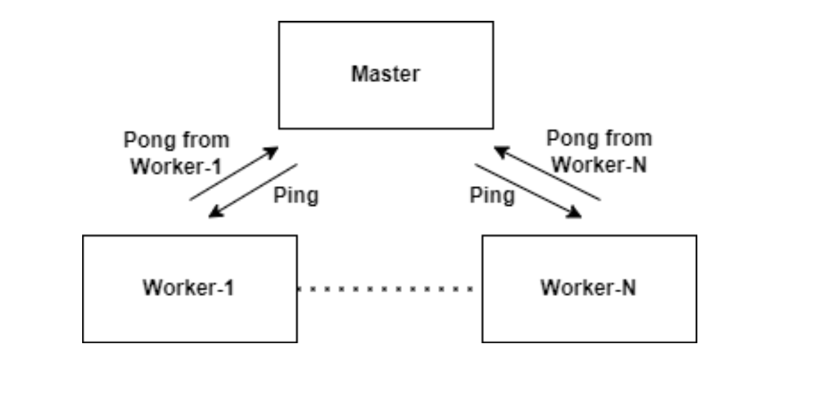
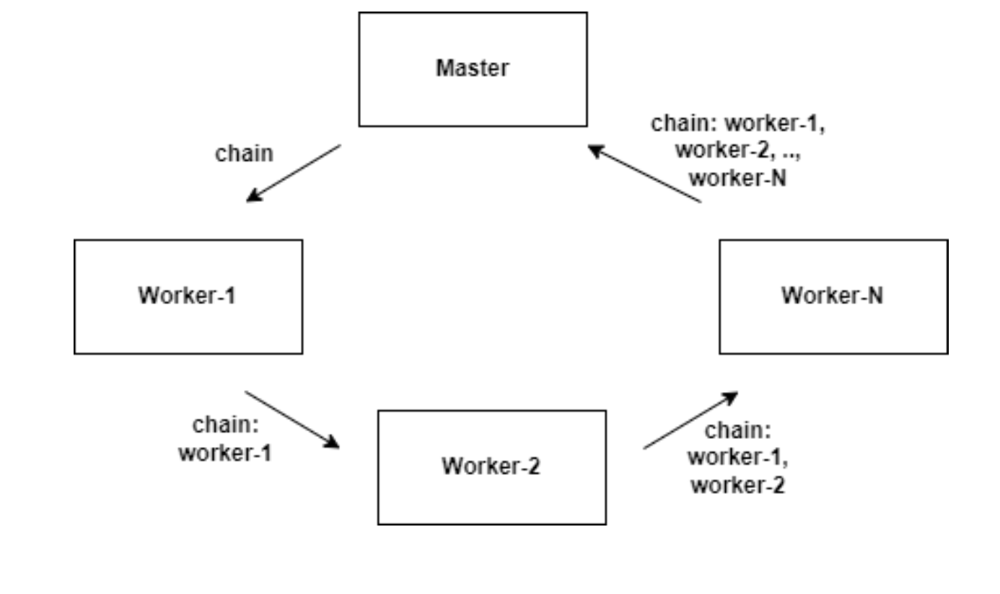

# Task-Sony

## Description 
You are required to implement a distributed system using Java. The system consists
of a master node and multiple worker nodes. The number of workers should be
configurable. Each of the workers will communicate with each other based on the
following patterns:

### One-to-One Messaging
The master node sends a "ping" message to each
worker node. Each worker node should respond with a message indicating
that it received the ping.

Example execution:
```bash
Using values:
Master Port: 12346
Delay (ms): 500
PingPong Times: 2
Number of Workers: 3
Command: PING
Master node started on port 12346
WorkerWorker n°0 connected
WorkerWorker n°1 connected
WorkerWorker n°2 connected
(Master) WorkerHandler started
(Worker n°1) Received: {"type":"PING","message":"Ping"}
(Worker n°2) Received: {"type":"PING","message":"Ping"}
(Worker n°0) Received: {"type":"PING","message":"Ping"}
(Master) From Worker n°1 : PONG
(Master) From Worker n°2 : PONG
(Master) From Worker n°0 : PONG
(Worker n°0) Received: {"type":"PING","message":"Ping"}
(Worker n°1) Received: {"type":"PING","message":"Ping"}
(Worker n°2) Received: {"type":"PING","message":"Ping"}
(Master) From Worker n°0 : PONG
(Master) From Worker n°1 : PONG
(Master) From Worker n°2 : PONG
(Master) No message received for 2000 milliseconds. Terminating thread.
(Worker n°0) Received: {"type":"EXIT","message":""}
(Worker n°1) Received: {"type":"EXIT","message":""}
(Worker n°2) Received: {"type":"EXIT","message":""}

Process finished with exit code 0
```

### Broadcasting
The master node sends a "broadcast" message to all worker
nodes simultaneously. Each worker should respond with a message
indicating that it received the broadcast

Example execution:
```bash
Using values:
Master Port: 12346
Delay (ms): 500
PingPong Times: 5
Number of Workers: 3
Command: BROADCAST
Master node started on port 12346
WorkerWorker n°0 connected
WorkerWorker n°2 connected
WorkerWorker n°1 connected
(Master) WorkerHandler started
(Worker n°1) Received: {"type":"BROADCAST","message":"Hello Workers!"}
(Worker n°2) Received: {"type":"BROADCAST","message":"Hello Workers!"}
(Worker n°0) Received: {"type":"BROADCAST","message":"Hello Workers!"}
(Master) From Worker n°1 : Hi master!
(Master) From Worker n°2 : Hi master!
(Master) From Worker n°0 : Hi master!
(Master) No message received for 2000 milliseconds. Terminating thread.
(Worker n°0) Received: {"type":"EXIT","message":""}
(Worker n°1) Received: {"type":"EXIT","message":""}
(Worker n°2) Received: {"type":"EXIT","message":""}

Process finished with exit code 0
```
### Round-Robin Messaging
The master node sends a "chain" message to the
first worker node. This message should be passed from one worker to the
next and finally returned to the master node. Each worker should append its
name to the message before forwarding it

Example execution:
```bash
Using values:
Master Port: 12346
Delay (ms): 500
PingPong Times: 2
Number of Workers: 4
Command: chain
Master node started on port 12346
WorkerWorker n°0 connected
WorkerWorker n°1 connected
WorkerWorker n°2 connected
WorkerWorker n°3 connected
(Master) WorkerHandler started
(Worker n°0) Received: {"index":0,"type":"CHAIN","message":"Chain Start","workers":{"worker0":{"address":"127.0.0.1","port":58245},"worker1":{"address":"127.0.0.1","port":55234},"worker2":{"address":"127.0.0.1","port":64819},"worker3":{"address":"127.0.0.1","port":50763}}}
(Worker n°1) Received: {"index":1,"type":"CHAIN","message":"Chain Start -> Worker n°0","workers":{"worker0":{"address":"127.0.0.1","port":58245},"worker1":{"address":"127.0.0.1","port":55234},"worker2":{"address":"127.0.0.1","port":64819},"worker3":{"address":"127.0.0.1","port":50763}}}
(Worker n°2) Received: {"index":2,"type":"CHAIN","message":"Chain Start -> Worker n°0 -> Worker n°1","workers":{"worker0":{"address":"127.0.0.1","port":58245},"worker1":{"address":"127.0.0.1","port":55234},"worker2":{"address":"127.0.0.1","port":64819},"worker3":{"address":"127.0.0.1","port":50763}}}
(Worker n°3) Received: {"index":3,"type":"CHAIN","message":"Chain Start -> Worker n°0 -> Worker n°1 -> Worker n°2","workers":{"worker0":{"address":"127.0.0.1","port":58245},"worker1":{"address":"127.0.0.1","port":55234},"worker2":{"address":"127.0.0.1","port":64819},"worker3":{"address":"127.0.0.1","port":50763}}}
(Master) From Worker n°3 : Chain completed: Chain Start -> Worker n°0 -> Worker n°1 -> Worker n°2 -> Worker n°3
(Master) No message received for 2000 milliseconds. Terminating thread.
(Worker n°0) Received: {"type":"EXIT","message":""}
(Worker n°1) Received: {"type":"EXIT","message":""}
(Worker n°2) Received: {"type":"EXIT","message":""}
(Worker n°3) Received: {"type":"EXIT","message":""}

Process finished with exit code 0
```
## repository structure 
```angular2html
├── README.md
├── lib
│   ├── json-20210307.jar
│   ├── json4s-ast_2.11-4.0.4.jar
│   └── scala-library-2.11.12.jar
├── media
│   └── task-description.png
├── out
│   └── production
│       └── task-sony
│           ├── Main.class
│           ├── MasterNode.class
│           ├── WorkerHandler.class
│           └── WorkerNode.class
├── src
│   ├── Main.java
│   ├── MasterNode.java
│   ├── WorkerHandler.java
│   └── WorkerNode.java
└── task-sony.iml

```